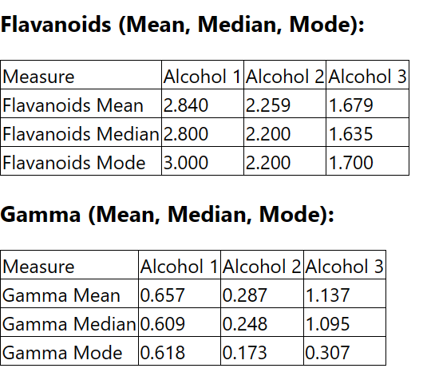

# Manufac Analytics

## Step to run the project:

### `Remember node,yarn should be previously installed in your machine.`
### `1. Download the file to the Desktop` 
### `2. Open the command prompt`
### `3. cd Desktop/manufac-assignment`
### `4. yarn start`
## 1. In first table we have to find mean,median and mode of the "Flavanoids"

### `The “Class” of alcohol is denoted by the “Alcohol” property`

## 2. In second table we have to find Gamma mean,median and mode of the "Flavanoids"

### `Here, Gamma = (Ash * Hue) / Magnesium`

## 3. Screenshot of both the table

)